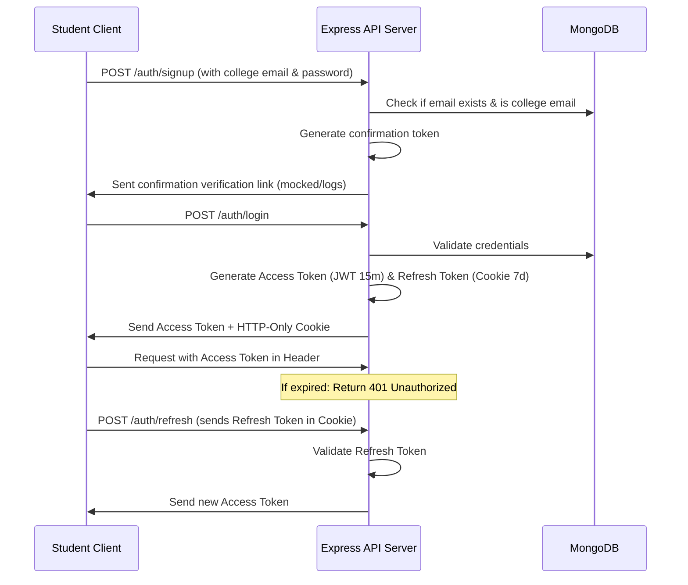

# College Social Network - Implementation Plan & Architecture

This document describes the design, architecture, database schemas, folder structure, and step-by-step implementation roadmap for building the college-exclusive social media web application.

---

## 1. Project Folder Structure

We will adopt a clean, monorepo-style separation of concerns with a `client/` frontend and a `server/` backend. 

```
subscript/
├── client/                     # Frontend Vue 3 application
│   ├── public/
│   ├── src/
│   │   ├── assets/             # Global styles, fonts, static assets
│   │   ├── components/         # Shared, global UI elements (Buttons, Inputs, Modals, Cards)
│   │   ├── composables/        # Shared composables (useAuth, useTheme, etc.)
│   │   ├── layouts/            # Page layouts (DefaultLayout, AdminLayout, AuthLayout)
│   │   ├── modules/            # Domain-driven features (Modular pattern)
│   │   │   ├── auth/
│   │   │   │   ├── components/ # Auth-specific components (LoginForm, SignupForm)
│   │   │   │   ├── views/      # Views (LoginView, RegisterView)
│   │   │   │   ├── stores/     # Pinia auth store
│   │   │   │   ├── services/   # Auth API calls
│   │   │   │   ├── types/      # TypeScript interfaces for Auth
│   │   │   │   └── composables/# Composables specific to Auth
│   │   │   ├── profile/
│   │   │   ├── feed/
│   │   │   ├── interviews/
│   │   │   ├── resources/
│   │   │   ├── discussions/
│   │   │   ├── notifications/
│   │   │   ├── moderation/
│   │   │   ├── admin/
│   │   │   ├── ai/
│   │   │   └── analytics/
│   │   ├── router/             # Vue Router index and guards
│   │   ├── stores/             # Global Pinia stores (theme, notifications)
│   │   ├── services/           # HTTP Client configuration (Axios AxiosInstance)
│   │   ├── utils/              # Shared utilities (date formatting, text sanitization)
│   │   ├── App.vue             # Root component
│   │   └── main.ts             # Application entrypoint
│   ├── tailwind.config.js
│   ├── tsconfig.json
│   ├── vite.config.ts
│   └── package.json
│
├── server/                     # Backend Node.js / Express application
│   ├── src/
│   │   ├── config/             # Firebase admin connection, Environment variables setup
│   │   ├── constants/          # Application-wide constants, error messages
│   │   ├── controllers/        # Route handlers grouped by domain
│   │   ├── middlewares/        # Authentication, RBAC, Validation, Error Handling, Moderation
│   │   ├── models/             # Schema definitions & validation helpers for Firestore
│   │   ├── routes/             # Express routes
│   │   ├── services/           # Business logic, AI content checker, Firebase triggers
│   │   ├── utils/              # Token generator, password helper, file uploader
│   │   └── app.ts              # Express App setup & main export
│   ├── uploads/                # Directory for local media storage (or cloud temporary folder)
│   ├── package.json
│   ├── tsconfig.json
│   └── index.ts                # Server entry point
```

---

## 2. Firebase Firestore Database Schema Design

We will use **Cloud Firestore** for data storage. Since Firestore is document-oriented and NoSQL, we will structure our data into collections. Below are the schema specifications for the documents inside each collection.

### Core Collections

#### A. `users` Collection
- **Document ID**: `uid` (matching Firebase Auth / custom JWT uid)
- **Fields**:
  ```typescript
  interface UserDocument {
    email: string; // Must end with @college.edu
    fullName: string;
    rollNumber: string;
    branch: string;
    year: number; // 1, 2, 3, 4
    section: string;
    bio: string;
    profilePicture: string;
    skills: string[];
    programmingLanguages: string[];
    techStack: string[];
    projects: {
      title: string;
      description?: string;
      githubUrl?: string;
      liveUrl?: string;
    }[];
    achievements: string[];
    hackathons: string[];
    leetcodeUrl: string;
    codeforcesUrl: string;
    githubUrl: string;
    linkedinUrl: string;
    resumeUrl: string;
    placementStatus: 'unplaced' | 'placed' | 'internship';
    currentCompany: string;
    internships: {
      company: string;
      role: string;
      duration: string;
    }[];
    followersCount: number;
    followingCount: number;
    followers: string[]; // User UIDs
    following: string[]; // User UIDs
    bookmarks: string[]; // Post/Resource Document IDs
    likedPosts: string[]; // Post Document IDs
    role: 'student' | 'moderator' | 'admin';
    isVerified: boolean;
    createdAt: string; // ISO String
    updatedAt: string; // ISO String
  }
  ```

#### B. `posts` Collection
- **Document ID**: Auto-generated string
- **Fields**:
  ```typescript
  interface PostDocument {
    authorId: string; // Reference to users.uid
    authorName: string;
    authorPicture: string;
    content: string; // Rich Text HTML/Markdown
    images: string[];
    pdfs: string[];
    codeSnippets: {
      language: string;
      code: string;
    }[];
    likesCount: number;
    likes: string[]; // User UIDs who liked this post
    commentsCount: number;
    tags: string[]; // Lowercase search tags
    moderationStatus: 'pending_review' | 'approved' | 'flagged_hidden';
    toxicityScore: number;
    createdAt: string;
    updatedAt: string;
  }
  ```

#### C. `comments` Collection
- **Document ID**: Auto-generated string
- **Fields**:
  ```typescript
  interface CommentDocument {
    authorId: string; // Reference to users.uid
    authorName: string;
    authorPicture: string;
    postId: string; // Reference to posts.id or interviewExperiences.id
    content: string;
    likes: string[]; // User UIDs who liked
    parentCommentId: string | null; // Self-referential for replies
    replies: string[]; // Array of reply commentIds
    moderationStatus: 'pending_review' | 'approved' | 'flagged_hidden';
    createdAt: string;
  }
  ```

#### D. `interviewExperiences` Collection
- **Document ID**: Auto-generated string
- **Fields**:
  ```typescript
  interface InterviewExperienceDocument {
    authorId: string;
    authorName: string;
    company: string;
    role: string;
    packageDetails: string; // e.g., '12 LPA'
    type: 'internship' | 'full-time';
    mode: 'online' | 'offline';
    interviewRounds: {
      roundName: string; // e.g. Technical Round 1
      details: string;
    }[];
    codingQuestions: string[];
    systemDesignQuestions: string[];
    hrQuestions: string[];
    behavioralQuestions: string[];
    difficulty: 'easy' | 'medium' | 'hard';
    preparationTips: string;
    resources: string[];
    outcome: 'selected' | 'rejected' | 'pending';
    tags: string[];
    votes: string[]; // User UIDs (upvotes)
    commentsCount: number;
    createdAt: string;
    updatedAt: string;
  }
  ```

#### E. `resources` Collection
- **Document ID**: Auto-generated string
- **Fields**:
  ```typescript
  interface ResourceDocument {
    authorId: string;
    authorName: string;
    title: string;
    description: string;
    type: 'notes' | 'pdf' | 'cheat-sheet' | 'book' | 'roadmap' | 'video' | 'link';
    url?: string;
    files?: string[];
    category: 'subject' | 'semester' | 'technology' | 'placement' | 'dsa' | 'web-dev' | 'ai-ml' | 'cp';
    semester?: number;
    tags: string[];
    downloadsCount: number;
    createdAt: string;
    updatedAt: string;
  }
  ```

#### F. `auditLogs` Collection
- **Document ID**: Auto-generated string
- **Fields**:
  ```typescript
  interface AuditLogDocument {
    action: 'flagged_content' | 'ban_user' | 'override_approve';
    targetId: string; // ID of post, comment, or user
    targetType: 'User' | 'Post' | 'Comment' | 'Resource';
    performedBy: string; // UID of admin or 'system'
    reason: string;
    createdAt: string;
  }
  ```

---

## 3. Backend API Endpoints & Architecture

The API will run on `/api/v1` and handle JSON requests. Express router definitions will structure modules nicely.

| Method | Endpoint | Description | Middleware / Roles |
|--------|----------|-------------|---------------------|
| **POST** | `/api/v1/auth/signup` | Create student account (checks college email) | Guest |
| **POST** | `/api/v1/auth/login` | Log in student, returns access & refresh tokens | Guest |
| **POST** | `/api/v1/auth/refresh` | Refresh access token | Guest |
| **POST** | `/api/v1/auth/verify-email` | Verify email address using query code | Guest |
| **POST** | `/api/v1/auth/forgot-password` | Send password reset link | Guest |
| **POST** | `/api/v1/auth/reset-password`| Reset password using token | Guest |
| **GET** | `/api/v1/users/profile/:id` | Get user details | Auth |
| **PUT** | `/api/v1/users/profile` | Update profile (skills, projects, socials) | Auth |
| **POST** | `/api/v1/users/:id/follow` | Follow / Unfollow user | Auth |
| **GET** | `/api/v1/feed` | List home feed posts with pagination | Auth |
| **POST** | `/api/v1/feed/posts` | Create new post (calls AI Moderation service) | Auth |
| **PUT** | `/api/v1/feed/posts/:id` | Edit post content | Auth (Author only) |
| **DELETE** | `/api/v1/feed/posts/:id` | Delete post | Auth (Author / Admin) |
| **POST** | `/api/v1/feed/posts/:id/like` | Like/Unlike post | Auth |
| **POST** | `/api/v1/feed/posts/:id/comments` | Add comment | Auth |
| **GET** | `/api/v1/interviews` | List interview experiences | Auth |
| **POST** | `/api/v1/interviews` | Create interview experience | Auth |
| **POST** | `/api/v1/resources` | Share notes, links, roadmap or file | Auth |
| **GET** | `/api/v1/resources` | Query shared resources | Auth |
| **GET** | `/api/v1/search` | Global unified search endpoint | Auth |
| **GET** | `/api/v1/admin/moderation-queue`| View hidden/flagged posts & comments | Auth, Admin/Moderator |
| **POST** | `/api/v1/admin/moderation/:id/resolve`| Approve or lock moderated item | Auth, Admin/Moderator |

---

## 4. Authentication Flow



---

## 5. UI Layout, Component Hierarchy & Wireframes

### Global Component Hierarchy
- **App.vue**
  - **AuthLayout** (Login, Registration, Verification views)
  - **DefaultLayout** (Sidebar navigation, Top Navbar with global search, Notifications bell, Main Feed / Modules panels, Right Sidebar with placement stats and trending tags)
    - **Header**
    - **Sidebar**
    - **MainContent (RouterView)**
      - **HomeFeedView**: CreatePostCard, PostFeedList, PostCard, RichEditor, CodeBlockViewer, CommentsSection
      - **ProfileView**: ProfileHeader, InfoCard, ProjectsCard, ExperienceAccordion, ActivityFeed
      - **InterviewExperiencesView**: FiltersHeader, InterviewCardList, InterviewDetailModal
      - **ResourceSharingView**: CategoriesTabs, ResourceList, ResourceCard, UploadModal
      - **DiscussionForumView**: ForumsList, CategoryCard, DiscussionsDetail
      - **AdminDashboardView**: StatsSummary, ModerationQueueTable, ReportsList, UsersManager
  - **ToasterNotificationSystem**

### Wireframe Layout Structure (Dashboard / Main Page)
```
+-------------------------------------------------------------------------------+
| Logo           [ Search Student, Post, Interview, Resource ]   (Bell) (Profile)|
+-------------------------------------------------------------------------------+
| (Nav)          |   [Share experience / Write post]                             |
| - Home Feed    |   -------------------------------------------------           |
| - Interviews   |   [Post Card: Author, Time]                                   |
| - Resources    |   Content snippet ... [Show code / Read details]              |
| - Forums       |   [Like (24)] [Comment (12)] [Bookmark]                       |
| - Admin (if)   |   -------------------------------------------------           |
|                |   [Post Card: Author] ...                                     |
+-------------------------------------------------------------------------------+
```

---

## 6. AI Content Moderation System Architecture

We will implement an extensible modular AI moderation service:

1. **Content Submission**: Users post text, code, or resource details.
2. **Pre-Moderation Check (`AIModerationService`)**:
   - Analyzes text content against predefined toxicity dictionaries, patterns, and structure.
   - Assigns `toxicityScore` (0 to 1), `spamScore` (0 to 1), and `confidenceScore`.
   - Analyzes keyword lists for personal details (doxxing), extreme profanity, and promotional spam.
3. **Workflow Routing**:
   - **Toxicity Score < 0.4**: Automatically approved, visible immediately.
   - **0.4 <= Toxicity Score < 0.7**: Request review/revision or flag for Moderator review, but keep visible with a caution flag, or hide temporarily until moderator overrides.
   - **Toxicity Score >= 0.7**: High confidence violation. Hide post immediately (`moderationStatus = 'flagged_hidden'`), log into `AuditLog`, create item in moderator dashboard.
4. **Appeals Process**: Users can view their flagged posts and click "Appeal" to write a justification, adding it to the moderator review queue.

---

## 7. Recommendation Engine System Architecture

A lightweight, profile-and-interest-matching algorithm will rank items dynamically for the user:
- **Interest-Based Matching**: Matches tags of posts and categories of resources against user’s `skills`, `techStack`, and `programmingLanguages`.
- **Collaborative Interaction**: Elevates items that have high bookmark or like counts from users in the same `branch` and `year`.
- **Placement & Interviews**: Filters and recommends interview experiences of companies that fit user's stated interests or target companies.

---

## 8. Verification & Performance Plan

### Automated Verification
We will verify API endpoints using Postman or a custom local integration test script (`test-endpoints.js`) simulating the client actions.
We will run TypeScript compilers (`tsc --noEmit`) to verify strict typing correctness across both packages.

### Performance Optimizations
- **Virtual Scrolling / Infinite Scrolling**: Feed items will render lazily using VueUse's `useIntersectionObserver`.
- **Optimistic UI updates**: Instant likes/bookmarks increment/decrement visual status before server confirmation is fully returned.
- **Debounced Searches**: User input in the search bar is debounced by 300ms using VueUse's `debouncedWatch` to avoid API hammering.

---

## 9. Step-by-Step Implementation Roadmap

We will work systematically in five core phases:

### Phase 1: Environment Setup & Core Foundations
1. Initialize the Vite + Vue 3 + TS client project and Node + TS server project.
2. Configure Tailwind CSS on the client and Express + MongoDB Mongoose on the server.
3. Establish global styles, themes, and Axios instance configurations.

### Phase 2: Core Authentication, Schemas & User Profiles
1. Build Mongoose schemas for User, Post, Comment, Resource, and InterviewExperience.
2. Set up backend JWT sign, verify, token refresh, and route guards.
3. Build the Frontend Signup, Login, Profile Views, and state stores.

### Phase 3: Feed, Resources, and Interview Modules
1. Implement the Home Feed API endpoints with pagination and creation tools (rich text, code snippets).
2. Code Vue views for creating/viewing posts, sharing interview round details, and categorization of notes.
3. Set up searching, liking, and comments (including sub-replies).

### Phase 4: AI Moderation, Admin Dashboard & Recommendations
1. Program the AI Content Moderation service mockup/implementation evaluating text inputs.
2. Build the Moderator Queue and Admin dashboard for audits, metrics, and user management.
3. Integrate the simple recommenders for resources and students.

### Phase 5: Verification & Walkthrough
1. Confirm all routes function properly.
2. Check for typescript type validation.
3. Generate the walkthrough documentation showing UI state and capabilities.

---

## User Review Required

> [!IMPORTANT]
> The backend authentication checks college emails. We will restrict email addresses ending with `.edu` or specific college domains (e.g. `college.edu`). Let us know if you want a custom regex or a wider range of allowed emails.

> [!NOTE]
> AI content moderation is simulated as a service that evaluates toxicity scores using standard NLP dictionaries and pattern matching. It is designed to be easily swappable with a live OpenAI, Hugging Face, or Google Gemini API integration.

Please review the proposed plan. If it looks good, click **Proceed** to start the implementation.
